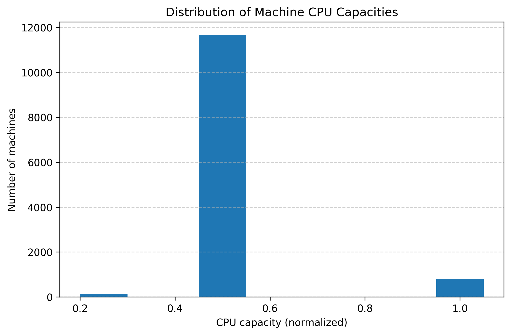
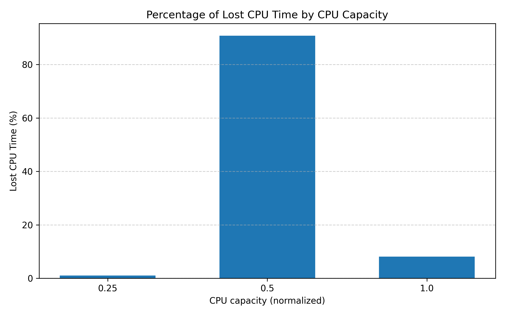

# Google-Cluster-Dataset-Spark-Project

- By: Soufiane ABAHAMID - Mohamed Quehlaoui
- Team: AK
- Data Subset: 180 - 184

# Anaylsis 1: Distribution of Machine CPU Capacities

**Dataset used:** _machine_events_  
**Execution scope:** whole dataset (single file `part-00000-of-00001.csv`)

To better understand the hardware heterogeneity of the cluster, we first analyzed the distribution of CPU capacities across all machines. The data was extracted from the _machine_events_ table, which provides information about each machine’s available resources over time. For each machine, we retained only the most recent event (the one with the latest timestamp) in order to represent its final known configuration during the trace period. Machine events corresponding to removal events were excluded from the analysis.

The CPU capacity values in the dataset are normalized, meaning that a value of 1.0 corresponds to the machine with the highest number of CPU cores in the cluster. Lower values represent machines with proportionally fewer cores (according to the google's documentation).



_Figure 1: Distribution of Machine CPU Capacities._

The results indicate that the majority of machines have a normalized CPU capacity of 0.5, suggesting a strong hardware homogeneity in the cluster. A smaller number of machines have higher capacities (around 1.0), which likely correspond to more powerful nodes intended for heavier workloads. Conversely, a very small fraction of machines have low CPU capacity (around 0.25), possibly representing older or specialized machines.

Overall, this distribution suggests that the cluster is largely composed of mid-range machines, with limited hardware heterogeneity. This design likely simplifies scheduling decisions and helps ensure predictable performance across tasks, while still allowing some flexibility through the presence of higher-capacity nodes.

# Analysis 2: Percentage of Computational Power Lost Due to Maintenance

**Dataset used:** _machine_events_  
**Execution scope:** whole dataset (single file `part-00000-of-00001.csv`)

In this analysis, we estimate the proportion of computational power that was unavailable due to machine maintenance, periods during which machines were removed from the cluster and later re-added. As specified in the assignment, the computational power lost depends on both the CPU capacity of the machines and the duration of their unavailability.

For a given machine ( m ), the lost computational power is computed as:

```math
\text{LostCPU}_m = \sum_{i} C_m \times \left(t^{\text{ADD}}_i - t^{\text{REMOVE}}_i\right)
```

where:

- $C_m$ is the normalized CPU capacity of machine $m$,
- $t^{\text{REMOVE}}_i$ is the timestamp of a REMOVE event,
- $t^{\text{ADD}}_i$ is the timestamp of the subsequent ADD event.

The total computational power lost across the cluster is then:

```math
\text{LostCPU}_{\text{total}} = \sum_{m} \text{LostCPU}_m
```

To compute the total computational power available in the cluster during the trace period, we approximate it as:

```math
\text{TotalCPU}_{\text{total}} = \sum_{m} C_m \times \left(T_{\text{end}} - t^{\text{ADD}}_m\right)
```

where:

- $T_{\text{end}}$ is the timestamp of the last event in the trace,
- $t^{\text{ADD}}_m$ is the timestamp of the first ADD event of machine $m$.

Finally, the percentage of computational power lost due to maintenance is given by:

```math
\text{Percentage Lost} =
\frac{\text{LostCPU}_{\text{total}}}{\text{TotalCPU}_{\text{total}}}
\times 100
```

The final result shows that approximately **0.48%** of the total computational power was lost due to maintenance-related machine unavailability. This percentage is relatively low, indicating that machine removals and maintenance events had a limited impact on the overall capacity of the cluster during the observed period. This suggests that the infrastructure is highly reliable and that maintenance operations are either infrequent or efficiently managed to minimize downtime

# Analysis 3: Maintenance Rate by CPU Capacity Class

**Dataset used:** _machine_events_  
**Execution scope:** whole dataset (single file `part-00000-of-00001.csv`)

In this analysis, we study whether certain classes of machines, defined by their CPU capacity, experience a higher maintenance rate than others. More precisely, we analyze how the lost computational power due to maintenance is distributed across machines with different normalized CPU capacities.

Using the _machine_events_ table, we grouped all events by machine ID and sorted them chronologically. For each machine, we computed the total CPU time lost due to maintenance by identifying REMOVE events followed by subsequent ADD events. The lost CPU time was calculated as the product of the machine’s CPU capacity and the duration between these two events. Each machine was then associated with its CPU capacity and its corresponding lost CPU time.

To compare maintenance impact across CPU classes, we aggregated the lost CPU time by CPU capacity and normalized it by the total lost CPU time across all machines. This allowed us to express the contribution of each CPU class as a percentage of the overall lost computational power.



_Figure 2: Percentage of lost CPU time by CPU capacity._

The results show that machines with a normalized CPU capacity of **0.5** account for the vast majority of the lost CPU time (over 90%). Machines with higher CPU capacity (1.0) contribute a much smaller fraction, while low-capacity machines (0.25) contribute only marginally.

This observation is largely explained by the distribution of machines in the cluster: as shown in Analysis 1, most machines belong to the 0.5 CPU capacity class. Therefore, even if maintenance events are uniformly distributed, this class naturally contributes more to the total lost CPU time. There is no strong evidence suggesting that higher-capacity machines experience a disproportionately higher maintenance rate compared to others.
