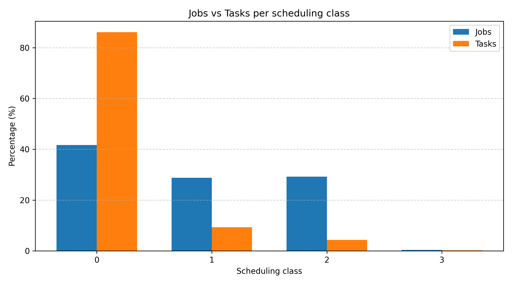
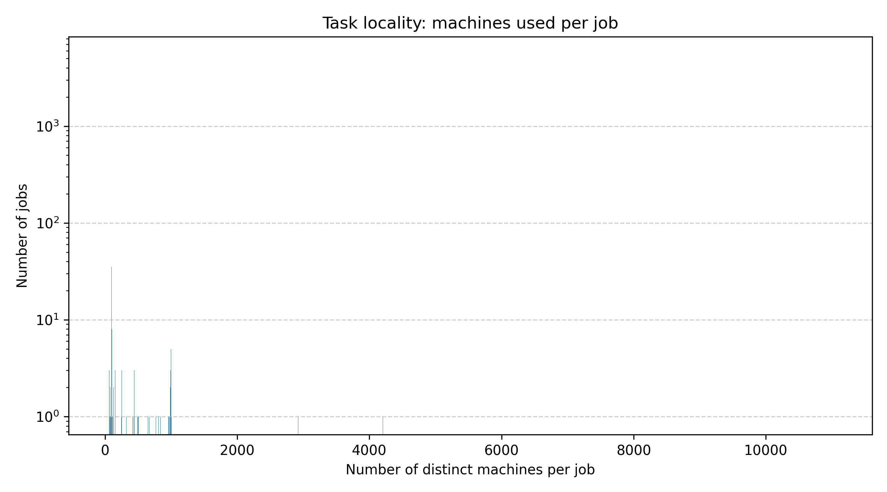
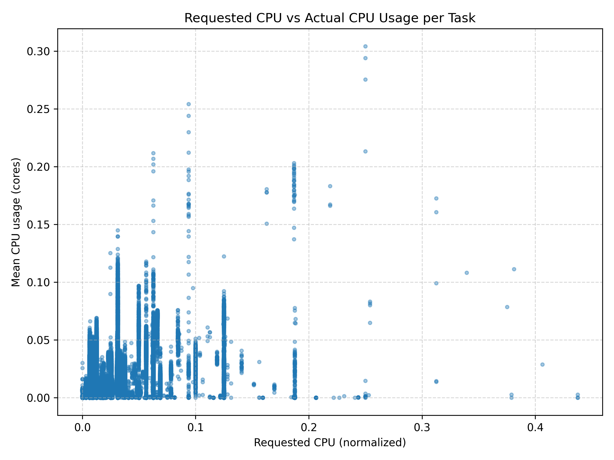
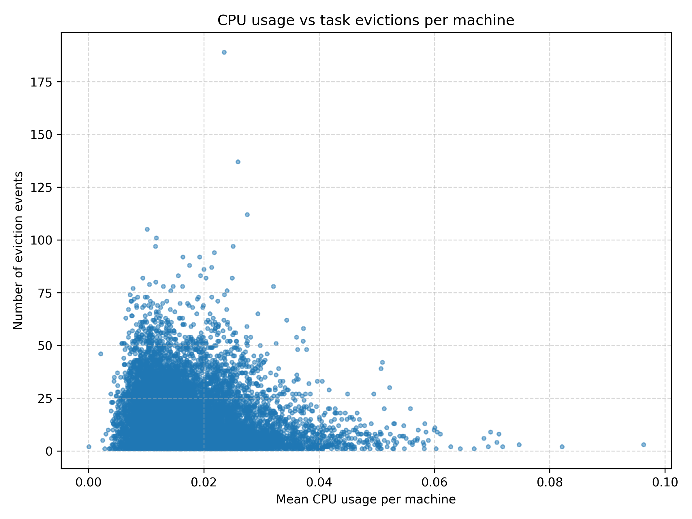

# Google-Cluster-Dataset-Spark-Project

- By: Soufiane ABAHAMID - Mohamed Quehlaoui
- Team: AK
- Data Subset: 180 - 184

# Anaylsis 1: Distribution of Machine CPU Capacities

**Dataset used:** _machine_events_  
**Execution scope:** whole dataset (single file `part-00000-of-00001.csv`)

To better understand the hardware heterogeneity of the cluster, we first analyzed the distribution of CPU capacities across all machines. The data was extracted from the _machine_events_ table, which provides information about each machine’s available resources over time. For each machine, we retained only the most recent event (the one with the latest timestamp) in order to represent its final known configuration during the trace period. Machine events corresponding to removal events were excluded from the analysis.

The CPU capacity values in the dataset are normalized, meaning that a value of **1.0** corresponds to the machine with the highest number of CPU cores in the cluster. Lower values represent machines with proportionally fewer cores (according to the google's documentation).


_Figure 1: Distribution of Machine CPU Capacities._

The results indicate that the majority of machines have a normalized CPU capacity of **0.5**, suggesting a strong hardware homogeneity in the cluster. A smaller number of machines have higher capacities (around **1.0**), which likely correspond to more powerful nodes intended for heavier workloads. Conversely, a very small fraction of machines have low CPU capacity (around **0.25**), possibly representing older or specialized machines.

Overall, this distribution suggests that the cluster is largely composed of mid-range machines, with limited hardware heterogeneity. This design likely simplifies scheduling decisions and helps ensure predictable performance across tasks, while still allowing some flexibility through the presence of higher-capacity nodes.

# Analysis 2: Percentage of Computational Power Lost Due to Maintenance

**Dataset used:** _machine_events_  
**Execution scope:** whole dataset (single file `part-00000-of-00001.csv`)

In this analysis, we estimate the proportion of computational power that was unavailable due to machine maintenance, periods during which machines were removed from the cluster and later re-added. As specified in the assignment, the computational power lost depends on both the CPU capacity of the machines and the duration of their unavailability.

For a given machine ( m ), the lost computational power is computed as:

```math
\text{LostCPU}_m = \sum_{i} C_m \times \left(t^{\text{ADD}}_i - t^{\text{REMOVE}}_i\right)
```

where:

- $C_m$ is the normalized CPU capacity of machine $m$,
- $t^{\text{REMOVE}}_i$ is the timestamp of a REMOVE event,
- $t^{\text{ADD}}_i$ is the timestamp of the subsequent ADD event.

The total computational power lost across the cluster is then:

```math
\text{LostCPU}_{\text{total}} = \sum_{m} \text{LostCPU}_m
```

To compute the total computational power available in the cluster during the trace period, we approximate it as:

```math
\text{TotalCPU}_{\text{total}} = \sum_{m} C_m \times \left(T_{\text{end}} - t^{\text{ADD}}_m\right)
```

where:

- $T_{\text{end}}$ is the timestamp of the last event in the trace,
- $t^{\text{ADD}}_m$ is the timestamp of the first ADD event of machine $m$.

Finally, the percentage of computational power lost due to maintenance is given by:

```math
\text{Percentage Lost} =
\frac{\text{LostCPU}_{\text{total}}}{\text{TotalCPU}_{\text{total}}}
\times 100
```

The final result shows that approximately **0.48%** of the total computational power was lost due to maintenance-related machine unavailability. This percentage is relatively low, indicating that machine removals and maintenance events had a limited impact on the overall capacity of the cluster during the observed period. This suggests that the infrastructure is highly reliable and that maintenance operations are either infrequent or efficiently managed to minimize downtime

# Analysis 3: Maintenance Rate by CPU Capacity Class

**Dataset used:** _machine_events_  
**Execution scope:** whole dataset (single file `part-00000-of-00001.csv`)

In this analysis, we study whether certain classes of machines, defined by their CPU capacity, experience a higher maintenance rate than others. More precisely, we analyze how the lost computational power due to maintenance is distributed across machines with different normalized CPU capacities.

Using the _machine_events_ table, we grouped all events by machine ID and sorted them chronologically. For each machine, we computed the total CPU time lost due to maintenance by identifying REMOVE events followed by subsequent ADD events. The lost CPU time was calculated as the product of the machine’s CPU capacity and the duration between these two events. Each machine was then associated with its CPU capacity and its corresponding lost CPU time.

To compare maintenance impact across CPU classes, we aggregated the lost CPU time by CPU capacity and normalized it by the total lost CPU time across all machines. This allowed us to express the contribution of each CPU class as a percentage of the overall lost computational power.


_Figure 2: Percentage of lost CPU time by CPU capacity._

The results show that machines with a normalized CPU capacity of **0.5** account for the vast majority of the lost CPU time (over **90%**). Machines with higher CPU capacity (**1.0**) contribute a much smaller fraction, while low-capacity machines (**0.25**) contribute only marginally.

This observation is largely explained by the distribution of machines in the cluster: as shown in Analysis 1, most machines belong to the **0.5** CPU capacity class. Therefore, even if maintenance events are uniformly distributed, this class naturally contributes more to the total lost CPU time. There is no strong evidence suggesting that higher-capacity machines experience a disproportionately higher maintenance rate compared to others.

# Analysis 4: Distribution of Jobs and Tasks per Scheduling Class

**Datasets used:** _job_events_ and _task_events_  
**Execution scope:** data subset (parts 180–184)

In this analysis, we study how jobs and tasks are distributed across the different **scheduling classes** defined in the Google cluster traces. The scheduling class ranges from **0 to 3** and represents how **latency-sensitive** a job or task is. It is important to note that the scheduling class is distinct from the task priority: while the scheduling class influences resource access policies at the machine level, the priority determines scheduling and eviction decisions.

We used two datasets for this analysis: the _job_events_ table and the _task_events_ table. For both datasets, the analysis was restricted to our assigned data subset (parts 180–184). For jobs, each distinct job ID was associated with its scheduling class. For tasks, we considered distinct pairs of job ID and task index along with their scheduling class.

For each scheduling class, we computed the percentage of jobs and the percentage of tasks relative to their respective totals.



_Figure 3: Percentage of jobs and tasks per scheduling class._

The results show a clear imbalance between the distribution of jobs and tasks across scheduling classes. Scheduling class **0**, which corresponds to the least latency-sensitive workloads, accounts for a moderate fraction of jobs but an overwhelming majority of tasks. This suggests that many jobs in this class are composed of a large number of tasks.

In contrast, scheduling classes **1** and **2** represent a comparable fraction of jobs but a much smaller fraction of tasks, indicating that these jobs tend to consist of fewer tasks. This behavior is consistent with workloads that are more latency-sensitive and less massively parallel. Scheduling class **3** represents only a very small fraction of both jobs and tasks, showing that highly latency-sensitive workloads are relatively rare in the cluster.

Overall, this analysis highlights strong structural differences between scheduling classes: jobs belonging to the lowest scheduling class (class 0) dominate the cluster in terms of task volume, while higher scheduling classes are associated with smaller, more latency-sensitive workloads.

# Analysis 5: Percentage of Jobs and Tasks that Were Evicted or Killed

**Datasets used:** _job_events_ and _task_events_  
**Execution scope:** data subset (parts 180–184)

In this analysis, we aim to determine whether the proportion of jobs and tasks that were **evicted or killed** during execution can be considered significant. Eviction events typically occur when resources are reclaimed by the scheduler, while kill events usually correspond to explicit cancellations or failures that prevent normal completion.

We used the _job_events_ and _task_events_ tables, restricting the analysis to our assigned data subset (parts 180–184). For jobs, we identified each unique job ID and checked whether it experienced at least one **EVICT** or **KILL** event during its lifecycle. Similarly, for tasks, we considered unique task identifiers defined by the pair (job ID, task index) and checked for eviction or kill events.

The results obtained are summarized below:

- **Total unique jobs:** 7,413

- **Jobs evicted or killed:** 3,065 (41.35%)

- **Total unique tasks:** 333,469

- **Tasks evicted or killed:** 126,052 (37.80%)

These results show that a substantial fraction of both jobs and tasks did not complete normally. More than 40% of jobs and nearly 38% of tasks experienced at least one eviction or kill event during their execution. This suggests that eviction and termination events are a common occurrence in the cluster, rather than exceptional cases.

It is important to note that this analysis was conducted on a restricted **subset of the data** (parts 180–184). As a result, the observed proportions of evicted and killed jobs and tasks may be influenced by the specific workload present in this time window.

# Analysis 6: Eviction Probability of Tasks by Scheduling Class

**Dataset used:** _task_events_  
**Execution scope:** data subset (parts 180–184)

In this analysis, we investigate whether tasks belonging to lower scheduling classes have a higher probability of being evicted. As defined in the Google cluster documentation, the **scheduling class** (ranging from 0 to 3) represents how latency-sensitive a task is, and it is distinct from the task priority, which directly influences scheduling and eviction decisions.

We used the _task_events_ table. Each task was uniquely identified by the pair (job ID, task index). For each scheduling class, we computed:

- the total number of distinct tasks
- the number of distinct tasks that experienced at least one **EVICT** event.

The eviction probability for a given scheduling class was then computed as:

```math
\text{Eviction Probability} =
\frac{\text{Number of evicted tasks}}{\text{Total number of tasks}}
\times 100
```

The results obtained are as follows:

- **Scheduling class 0:** 15.57%
- **Scheduling class 1:** 18.01%
- **Scheduling class 2:** 8.89%
- **Scheduling class 3:** 48.55%

These results show that tasks in **scheduling class 3** have a significantly higher eviction probability than tasks in other classes. This observation may appear counterintuitive, as scheduling class 3 corresponds to the most latency-sensitive workloads. However, this behavior can be explained by the fact that scheduling class alone does not determine eviction decisions. Task **priority** play a major role in eviction events.

For scheduling classes 0, 1, and 2, eviction probabilities remain below 20%, with class 2 showing the lowest eviction rate. This suggests that lower scheduling classes do not necessarily suffer from systematically higher eviction probabilities within this subset.

# Analysis 7: Task Locality

**Dataset used:** _task_events_  
**Execution scope:** data subset (parts 180–184)

In this analysis, we investigate whether tasks belonging to the same job tend to run on the same machine, which provides insight into the **locality strategy** adopted by the cluster scheduler. High locality can improve performance by reducing data movement and cache misses, while low locality may improve load balancing and fault tolerance.

We focused exclusively on **SCHEDULE** events, as they indicate the actual placement of tasks on machines. Each task was uniquely identified by the pair (job ID, task index).

For each job, we counted the number of **distinct machines** on which its tasks were scheduled. We then computed the distribution of jobs according to this number, i.e., how many jobs ran on 1 machine, 2 machines, and so on.



_Figure 4: Distribution of the number of distinct machines used per job (logarithmic scale)._

The results show a **highly skewed (heavy-tailed)** distribution. A large number of jobs are scheduled on a **small number of machines**, often just one or a few, which suggests that the scheduler tends to preserve locality for many jobs. This behavior is beneficial for workloads that repeatedly access the same data or benefit from cache reuse.

At the same time, a small number of jobs are spread across **hundreds or even thousands of machines**. These jobs are likely large-scale, highly parallel workloads that prioritize throughput and load balancing over locality.

Overall, this analysis indicates that the cluster scheduler adopts a **hybrid locality strategy**. For smaller or less parallel jobs, it favors task locality by limiting the number of machines involved. For large-scale jobs, it sacrifices locality in favor of parallelism and scalability.

# Analysis 8: Relationship Between Requested and Actual CPU Usage

**Datasets used:** _task_events_ and _task_usage_  
**Execution scope:** data subset (parts 180–184)

In this analysis, we investigate whether tasks that request more CPU resources are also the ones that actually consume more CPU during execution. Understanding this relationship is important for evaluating the accuracy of user resource requests and the effectiveness of the cluster’s resource allocation strategy.

We used two datasets for this analysis: the _task_events_ table to extract CPU resource requests, and the _task_usage_ table to measure actual CPU consumption.

Each task was uniquely identified by the pair (job ID, task index). For each task, we retained the **maximum CPU request** observed in the task events and computed the **mean CPU usage** over all available usage records. We then joined these two values to compare requested versus consumed CPU for each task.



_Figure 5: Requested CPU versus mean actual CPU usage per task._

The scatter plot reveals a **weak correlation** between requested CPU and actual CPU usage. Many tasks request a non-negligible amount of CPU but exhibit very low average CPU usage, indicating systematic **overestimation of resource requirements**. Conversely, a small number of tasks consume significantly more CPU than average, even when their requested CPU is relatively modest.

Overall, this analysis shows that tasks requesting more resources are **not necessarily** the ones that consume more resources in practice. This mismatch between requested and actual usage highlights the challenges of resource estimation in large-scale cluster environments and justifies the scheduler’s reliance on dynamic resource sharing and overcommitment.

# Analysis 9: Relationship Between CPU Usage Peaks and Task Evictions

**Datasets used:** _task_events_ and _task_usage_  
**Execution scope:** data subset (parts 180–184)

In this analysis, we investigate whether high CPU usage on machines is associated with an increased number of task eviction events. The goal is to determine whether peaks in resource consumption may lead to task evictions, which would indicate resource contention or overcommitment at the machine level.

We used two datasets for this analysis. From the _task_events_ table, we extracted **EVICT** events and counted, for each machine, the total number of task evictions it experienced. From the _task_usage_ table, we computed the **mean CPU usage per machine** by averaging the CPU usage rates observed across all task usage records for that machine.

We then joined these two metrics by machine ID, obtaining for each machine a pair consisting of its mean CPU usage and its number of eviction events. These values were visualized using a scatter plot.



_Figure 6: Mean CPU usage versus number of task eviction events per machine._

The scatter plot does not reveal a strong positive correlation between mean CPU usage and the number of eviction events. While some machines with relatively low average CPU usage experience a high number of evictions, machines with higher average CPU usage do not consistently exhibit more eviction events. In fact, eviction events appear to be spread across a wide range of CPU usage levels.

This suggests that **average CPU usage alone is not a sufficient indicator** of eviction likelihood. Evictions are likely influenced by more complex factors such as short-lived CPU spikes, memory pressure, task priorities, and scheduling decisions related to overcommitment. Since we rely on mean CPU usage, transient peaks that may trigger evictions are not fully captured by this metric.

# Analysis 10: Frequency of Machine Resource Overcommitment

**Datasets used:** _machine_events_ and _task_events_  
**Execution scope:**

- _machine_events_: whole dataset (single file `part-00000-of-00001.csv`)
- _task_events_: data subset (parts 180–184)

In this analysis, we study how often machines in the cluster are **over-committed**, i.e., situations where the total CPU resources requested by running tasks exceed the CPU capacity available on a machine.

Using the _machine_events_ dataset, we reconstructed the **CPU capacity timeline** of each machine over time. From the _task_events_ dataset, we reconstructed the **CPU demand timeline** by interpreting task scheduling and termination events as changes in requested CPU.

For a given machine $m$, let:

- $C_m(t)$ be the CPU capacity of machine $m$ at time $t$,
- $D_m(t)$ be the total CPU demand on machine $m$ at time $t$, computed as the sum of CPU requests of all tasks running on that machine at time $t$.

A machine is considered **over-committed** at time $t$ if:

```math
D_m(t) > C_m(t)
```

For each machine $m$, we compute the fraction of time during which it is over-committed as:

```math
\text{OvercommitFraction}_m =
\frac{
\int \mathbf{1}_{\{D_m(t) > C_m(t)\}} \, dt
}{
\int dt
}
```

where $\mathbf{1}_{{D_m(t) > C_m(t)}}$ is an indicator function equal to 1 when the machine is over-committed and 0 otherwise.

In practice, since events are discrete, this integral is approximated by summing over consecutive time intervals between events.

To obtain a global measure for the cluster, we compute the average overcommitment fraction across all machines:

```math
\text{AverageOvercommitment} =
\frac{1}{|\mathcal{M}|}
\sum_{m \in \mathcal{M}}
\text{OvercommitFraction}_m
```

where $\mathcal{M}$ is the set of machines.

Using this method, we obtained:

```math
\text{AverageOvercommitment} \approx 0.00034
```

This means that machines are over-committed for approximately **0.034% of the time**, indicating that CPU overcommitment is a **very rare event** in the observed data.

This result suggests that the cluster scheduler adopts a conservative approach with respect to CPU allocation, likely relying on task eviction, priority handling, and dynamic resource sharing to manage contention rather than allowing sustained overcommitment.
